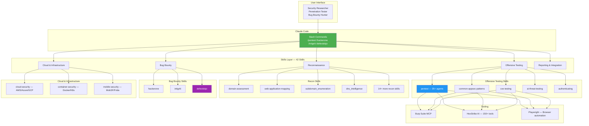
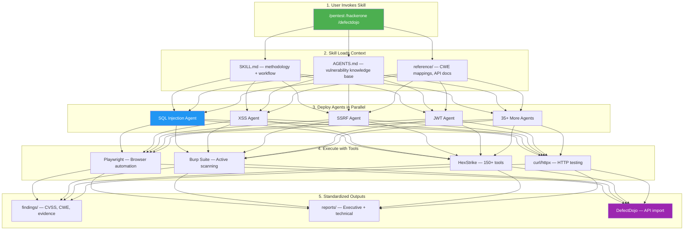

# Transilience AI Community Security Tools

<div align="center">

[](https://choosealicense.com/licenses/mit/)
[](CONTRIBUTING.md)
[](https://github.com/transilienceai/communitytools/issues)
[](https://github.com/transilienceai/communitytools/stargazers)
[](https://claude.ai)

**Open-source Claude Code skills, agents, and slash commands for AI-powered penetration testing, bug bounty hunting, and security research**

[Quick Start](#-quick-start) | [Documentation](#-documentation) | [Contributing](CONTRIBUTING.md) | [Website](https://www.transilience.ai)

</div>

---

## Table of Contents

- [Overview](#-overview)
- [Architecture](#-architecture)
- [Available Skills](#-available-skills)
- [Use Cases](#-use-cases)
- [Quick Start](#-quick-start)
- [How It Works](#-how-it-works)
- [Contributing](#-contributing)
- [Security & Legal](#-security--legal)
- [Roadmap](#-roadmap)
- [License](#-license)

---

## Overview

**Transilience AI Community Tools** is a comprehensive collection of **Claude Code skills, agents, and slash commands** for security testing, penetration testing, and bug bounty hunting. This repository provides AI-powered security workflows that run directly in Claude Code, enabling automated vulnerability testing, reconnaissance, and professional security reporting.

### What's Inside?

- **42 Security Skills** - Pentest, recon, bug bounty, cloud/container/mobile security, vulnerability management
- **35+ Specialized Agents** - SQL injection, XSS, SSRF, JWT, OAuth, SSTI, XXE, and more
- **151 Attack Documentation Files** - PortSwigger Academy solutions, cheat sheets, quickstart guides
- **3 Bug Bounty Platforms** - HackerOne, Intigriti, and DefectDojo integration
- **Professional Tooling** - Burp Suite MCP, HexStrike AI (150+ tools), Playwright automation
- **Standardized Outputs** - Professional reports with CVSS scoring and evidence

### Why Choose Transilience Community Tools?

- **AI-Powered Automation** - Claude AI orchestrates intelligent security testing workflows
- **42 Specialized Skills** - From recon to reporting, covering the full pentest lifecycle
- **Complete OWASP Coverage** - 100% OWASP Top 10 + SANS Top 25 CWE testing
- **Professional Reporting** - CVSS 3.1, CWE, MITRE ATT&CK, remediation guidance
- **Multi-Platform Bug Bounty** - HackerOne, Intigriti, and DefectDojo workflows
- **Cloud & Container Security** - AWS, Azure, GCP, Docker, Kubernetes testing
- **Playwright + Burp Suite** - Browser automation and professional proxy integration
- **Open Source** - MIT licensed for commercial and personal use

---

## Architecture

### AGENTS.md + Skills Hybrid Architecture

Based on [Vercel research](https://vercel.com/blog/agents-md-outperforms-skills-in-our-agent-evals), this repository uses a hybrid architecture achieving 100% pass rate in agent evals:

- **AGENTS.md** (always loaded) - Compressed security knowledge base with vulnerability payloads, methodologies (PTES, OWASP, MITRE), CVSS scoring, and PoC standards
- **Skills** (user-triggered) - Workflow orchestration invoked via `/skill-name` for multi-step processes



### Repository Structure

```
communitytools/
├── AGENTS.md                  # Passive security knowledge base (always loaded)
├── CLAUDE.md                  # Repository-wide instructions
├── .claude/
│   ├── skills/                # 42 security testing skills
│   │   ├── pentest/           # 46+ attack types, 151 docs, 35+ agents
│   │   ├── hackerone/         # HackerOne bug bounty automation
│   │   ├── intigriti/         # Intigriti bug bounty automation
│   │   ├── defectdojo/        # Vulnerability management (IAP auth, API import)
│   │   ├── burp-suite/        # Burp Suite Professional MCP integration
│   │   ├── hexstrike/         # HexStrike AI — 150+ security tools
│   │   ├── cloud-security/    # AWS, Azure, GCP testing
│   │   ├── container-security/# Docker, Kubernetes testing
│   │   ├── mobile-security/   # MobSF + Frida instrumentation
│   │   ├── ai-threat-testing/ # OWASP LLM Top 10 testing
│   │   ├── authenticating/    # Auth testing, 2FA bypass, bot evasion
│   │   ├── domain-assessment/ # Subdomain discovery, port scanning
│   │   ├── web-application-mapping/ # Endpoint discovery, tech detection
│   │   ├── cve-testing/       # CVE vulnerability testing
│   │   ├── common-appsec-patterns/  # OWASP Top 10 testing
│   │   └── ... (27 more recon/utility skills)
│   │
│   ├── agents/                # Orchestration agents
│   │   └── skiller.md         # Skill creation/management
│   │
│   └── OUTPUT_STANDARDS.md    # Standardized output formats
│
├── outputs/                   # Generated findings and reports (gitignored)
├── templates/                 # Skill templates and GitHub templates
├── CONTRIBUTING.md            # Contribution guidelines
└── README.md                  # This file
```

---

## Available Skills

### Offensive Testing (5 skills)

| Skill | Command | Description |
|-------|---------|-------------|
| **Pentest** | `/pentest` | 7-phase pentest with 35+ parallel agents. SQL, XSS, SSRF, JWT, OAuth, SSTI, XXE, and more |
| **Common AppSec** | `/common-appsec-patterns` | OWASP Top 10 quick-hit testing |
| **CVE Testing** | `/cve-testing` | Known vulnerability testing with public exploits |
| **AI Threat Testing** | `/ai-threat-testing` | OWASP LLM Top 10 — prompt injection, model extraction, supply chain |
| **Authenticating** | `/authenticating` | Auth bypass, 2FA, CAPTCHA solving, bot evasion |

### Reconnaissance (19 skills)

| Skill | Command | Description |
|-------|---------|-------------|
| **Domain Assessment** | `/domain-assessment` | Subdomain discovery + port scanning coordinator |
| **Web App Mapping** | `/web-application-mapping` | Endpoint discovery, tech detection, headless browsing |
| **Subdomain Enumeration** | `/subdomain_enumeration` | CT logs, passive DNS, search engine dorks |
| **DNS Intelligence** | `/dns_intelligence` | MX, TXT, NS, CNAME, SRV tech signals |
| **Certificate Transparency** | `/certificate_transparency` | CT log queries, SAN extraction |
| **HTTP Fingerprinting** | `/http_fingerprinting` | Headers, cookies, error page analysis |
| **TLS Certificate Analysis** | `/tls_certificate_analysis` | Issuer, SAN, JARM fingerprints |
| **Security Posture** | `/security_posture_analyzer` | Headers, CSP, HSTS, WAF, security.txt |
| **CDN/WAF Fingerprinter** | `/cdn_waf_fingerprinter` | Cloudflare, Akamai, Fastly detection |
| **Frontend Inferencer** | `/frontend_inferencer` | React, Angular, Vue, jQuery, Bootstrap |
| **Backend Inferencer** | `/backend_inferencer` | Servers, languages, frameworks, databases, CMS |
| **Cloud Infra Detector** | `/cloud_infra_detector` | AWS, Azure, GCP, PaaS detection |
| **DevOps Detector** | `/devops_detector` | CI/CD, containerization, orchestration |
| **Third Party Detector** | `/third_party_detector` | Payments, analytics, auth, CRM, support |
| **IP Attribution** | `/ip_attribution` | WHOIS, ASN, cloud provider mapping |
| **Domain Discovery** | `/domain_discovery` | Official domain via web search, WHOIS, TLD patterns |
| **Code Repository Intel** | `/code_repository_intel` | GitHub/GitLab public repos, deps, CI configs |
| **Job Posting Analysis** | `/job_posting_analysis` | Tech requirements from career pages |
| **Web Archive Analysis** | `/web_archive_analysis` | Wayback Machine technology migrations |

### Bug Bounty Platforms (3 skills)

| Skill | Command | Description |
|-------|---------|-------------|
| **HackerOne** | `/hackerone` | Scope parsing, parallel testing, platform-ready submissions |
| **Intigriti** | `/intigriti` | API scope fetch, tier prioritization, EU-formatted reports |
| **DefectDojo** | `/defectdojo` | Vulnerability management — IAP auth, finding import, evidence upload |

### Cloud, Container & Mobile Security (3 skills)

| Skill | Command | Description |
|-------|---------|-------------|
| **Cloud Security** | `/cloud-security` | AWS, Azure, GCP — IAM, storage, serverless, CIS Benchmarks |
| **Container Security** | `/container-security` | Docker image scanning, K8s RBAC, pod security, escape testing |
| **Mobile Security** | `/mobile-security` | MobSF static analysis + Frida dynamic instrumentation |

### Professional Tooling (2 skills)

| Skill | Command | Description |
|-------|---------|-------------|
| **Burp Suite** | `/burp-suite` | PortSwigger MCP — active scanning, Collaborator, traffic replay |
| **HexStrike AI** | `/hexstrike` | 150+ security tools via MCP — network, web, binary, cloud |

### Reporting & Utilities (10 skills)

| Skill | Command | Description |
|-------|---------|-------------|
| **Evidence Formatter** | `/evidence_formatter` | Screenshot, video, HTTP log formatting |
| **JSON Report Generator** | `/json_report_generator` | Machine-readable findings output |
| **Report Exporter** | `/report_exporter` | Multi-format report export |
| **Signal Correlator** | `/signal_correlator` | Cross-skill signal correlation |
| **Confidence Scorer** | `/confidence_scorer` | Finding confidence scoring |
| **Conflict Resolver** | `/conflict_resolver` | Conflicting signal resolution |
| **HTML Content Analysis** | `/html_content_analysis` | Meta tags, generator comments, script URLs |
| **JavaScript DOM Analysis** | `/javascript_dom_analysis` | Global variables, DOM attributes, bundle patterns |
| **API Portal Discovery** | `/api_portal_discovery` | Developer docs, OpenAPI/Swagger endpoints |
| **Skiller** | `/skiller` | Skill creation, validation, and management |

---

## Use Cases

### 1. Penetration Testing

```bash
/pentest

# Deploys 35+ specialized agents in parallel:
# - Injection (SQL, NoSQL, Command, SSTI, XXE)
# - Client-side (XSS, CSRF, Clickjacking, CORS, Prototype Pollution)
# - Server-side (SSRF, HTTP Smuggling, File Upload, Path Traversal)
# - Authentication (JWT, OAuth, Auth Bypass, Password Attacks)
# - API (GraphQL, REST, WebSockets, Web LLM)
# - Business Logic (Race Conditions, Access Control, Cache Poisoning)
```

### 2. Bug Bounty Hunting

```bash
/hackerone     # HackerOne programs
/intigriti     # Intigriti programs

# Workflow: scope parsing → parallel testing → PoC validation → platform-ready reports
```

### 3. Vulnerability Management

```bash
/defectdojo <product> [engagement]

# Authenticates via API (supports Google Cloud IAP)
# Creates products/engagements/tests with user approval
# Imports findings with CWE mapping and evidence
# Deduplicates against existing findings
```

### 4. Cloud & Infrastructure Security

```bash
/cloud-security    # AWS, Azure, GCP misconfigurations
/container-security # Docker and Kubernetes testing
/mobile-security   # iOS and Android app testing
```

### 5. AI/LLM Security Testing

```bash
/ai-threat-testing

# Tests for OWASP LLM Top 10:
# - Prompt injection, insecure output handling
# - Training data poisoning, model extraction
# - Supply chain attacks, excessive agency
```

### 6. Full Reconnaissance Pipeline

```bash
/domain-assessment          # Subdomain discovery + port scanning
/web-application-mapping    # Endpoint and tech detection
/common-appsec-patterns     # OWASP Top 10 quick testing
/pentest                    # Full security assessment
/defectdojo                 # Import findings to DefectDojo
```

---

## Quick Start

### Prerequisites

- **Claude Code** - AI-powered IDE by Anthropic ([Install Claude Code](https://claude.ai/download))
- **Git** - For cloning the repository
- **Written Authorization** - Always get permission before testing any systems

### Installation

```bash
# Clone the repository
git clone https://github.com/transilienceai/communitytools.git
cd communitytools

# Open in Claude Code
claude .
```

Skills in `.claude/skills/` auto-load. No additional configuration needed.

### Usage

```bash
# Penetration testing
/pentest

# Bug bounty
/hackerone
/intigriti

# Reconnaissance
/domain-assessment
/web-application-mapping

# Vulnerability management
/defectdojo

# Cloud security
/cloud-security
/container-security

# Skill development
/skiller
```

### Output Structure

All skills produce standardized outputs:

```
outputs/<engagement>/
├── findings/           # JSON + markdown vulnerability reports
│   ├── finding-001/
│   │   ├── description.md    # Title, severity, CVSS, CWE, steps, remediation
│   │   └── evidence/         # Screenshots, PoC scripts, HTTP logs
│   └── finding-002/
├── reports/            # Executive + technical reports
└── activity/           # NDJSON activity logs
```

---

## How It Works

### Skill → Agent → Tool Execution Model



### Key Features

| Feature | Details |
|---------|---------|
| **OWASP Top 10** | 100% coverage |
| **SANS Top 25 CWE** | 90%+ coverage |
| **CVSS 3.1 Scoring** | All vulnerability findings |
| **MITRE ATT&CK** | TTPs mapped for all findings |
| **Evidence Capture** | Screenshots, videos, HTTP logs |
| **Deduplication** | Against existing findings in DefectDojo |
| **User Approval Gates** | All write operations require explicit confirmation |

---

## Contributing

We welcome contributions from the security community!

### Automated Workflow (Recommended)

```bash
/skiller

# Interactive prompts:
# 1. Create GitHub issue
# 2. Create feature branch
# 3. Generate skill structure and documentation
# 4. Validate against best practices
# 5. Commit and create PR
```

### Manual Workflow

```bash
# 1. Create issue
gh issue create --title "Add skill: X" --body "Description..."

# 2. Create branch
git checkout -b feature/skill-name

# 3. Develop skill following .claude/skills/ structure
# 4. Test by invoking in Claude Code
# 5. Commit with conventional format: feat(scope): description
# 6. Create PR linking to issue
```

**Git conventions:** `feat|fix|docs|refactor(scope): description` — see [CONTRIBUTING.md](CONTRIBUTING.md).

---

## Security & Legal

**These tools are designed for authorized security testing ONLY.**

**Authorized & Legal Use:**
- Penetration testing with written authorization
- Bug bounty programs within scope
- Security research on your own systems
- CTF competitions and training environments
- Educational purposes with proper permissions

**Prohibited & Illegal Use:**
- Unauthorized testing of any systems
- Malicious exploitation of vulnerabilities
- Data theft or system disruption
- Testing without explicit written permission
- Any use that violates local or international laws

**Users are solely responsible for compliance with all applicable laws and regulations.**

### Responsible Disclosure

If you discover a vulnerability using these tools:

1. **Do not exploit** beyond proof-of-concept
2. **Report immediately** to the vendor/organization
3. **Follow responsible disclosure** timelines (typically 90 days)
4. **Document thoroughly** for remediation

---

## Roadmap

### Delivered

- **42 Security Skills** covering offensive testing, recon, bug bounty, cloud/container/mobile, and reporting
- **Burp Suite MCP Integration** for professional web app testing
- **HexStrike AI Integration** with 150+ security tools
- **DefectDojo Integration** with IAP authentication and API-based finding import
- **Intigriti Platform Support** alongside HackerOne
- **AI/LLM Threat Testing** for OWASP LLM Top 10
- **Cloud Security** for AWS, Azure, GCP
- **Container Security** for Docker and Kubernetes
- **Mobile Security** with MobSF and Frida

### Planned

- Compliance reporting (PCI-DSS, SOC 2, ISO 27001)
- Blockchain/smart contract auditing
- IoT and firmware testing
- Additional bug bounty platform integrations

**Community contributions welcome** — [Feature Requests](https://github.com/transilienceai/communitytools/discussions/categories/feature-requests)

---

## Project Stats

| Category | Count |
|----------|-------|
| **Security Skills** | 42 |
| **Specialized Agents** | 35+ |
| **Attack Documentation** | 151 files |
| **Bug Bounty Platforms** | 3 (HackerOne, Intigriti, DefectDojo) |
| **Cloud Providers** | 3 (AWS, Azure, GCP) |
| **HexStrike Tools** | 150+ |
| **Output Standards** | 3 formats (recon, vuln, bounty) |

---

## About Transilience AI

[**Transilience AI**](https://www.transilience.ai) is an AI-powered security company specializing in autonomous security testing, threat intelligence, and security automation.

We believe in giving back to the security community by open-sourcing our tools and frameworks.

---

## Community & Support

- [GitHub Discussions](https://github.com/transilienceai/communitytools/discussions) - Questions and ideas
- [GitHub Issues](https://github.com/transilienceai/communitytools/issues) - Bug reports and features
- [Website](https://www.transilience.ai) - Company information

---

## License

MIT License - Copyright (c) 2025 Transilience AI. See [LICENSE](LICENSE).

---

<div align="center">

**Built with care by [Transilience AI](https://www.transilience.ai)**

[Website](https://www.transilience.ai) | [Report Issue](https://github.com/transilienceai/communitytools/issues) | [Discussions](https://github.com/transilienceai/communitytools/discussions)

`claude-code` `ai-security` `penetration-testing` `bug-bounty` `owasp` `hackerone` `intigriti` `defectdojo` `burp-suite` `cloud-security` `container-security` `mobile-security` `ai-threat-testing` `playwright` `security-automation`

</div>
